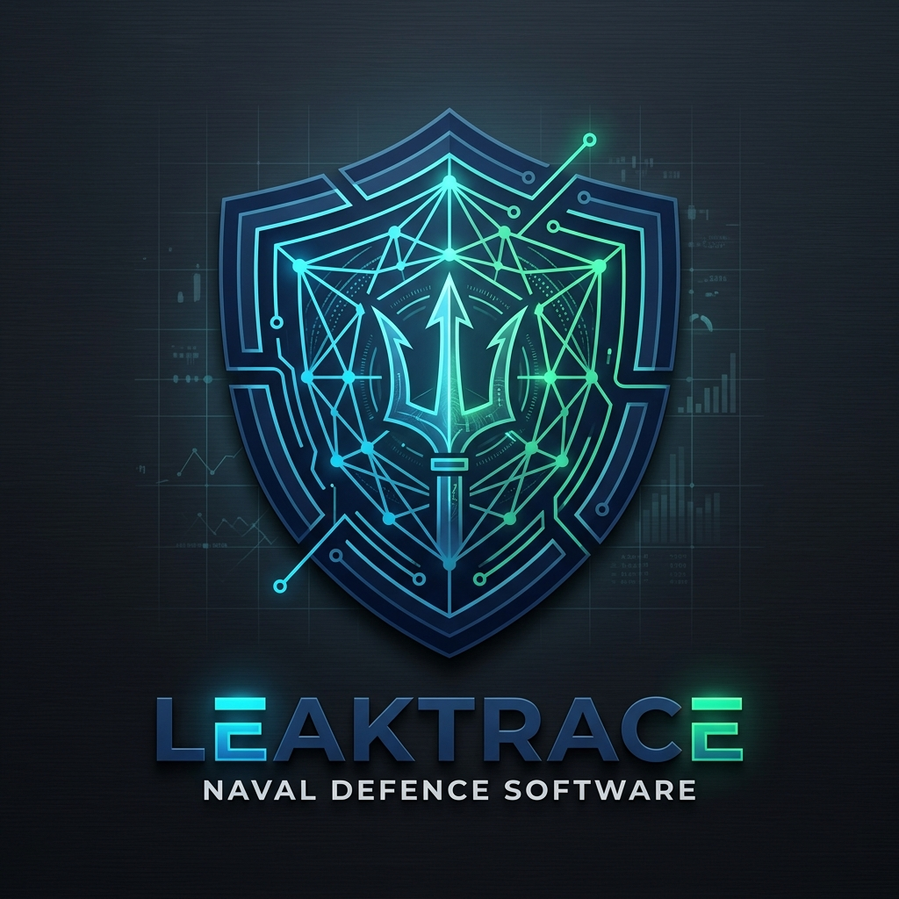
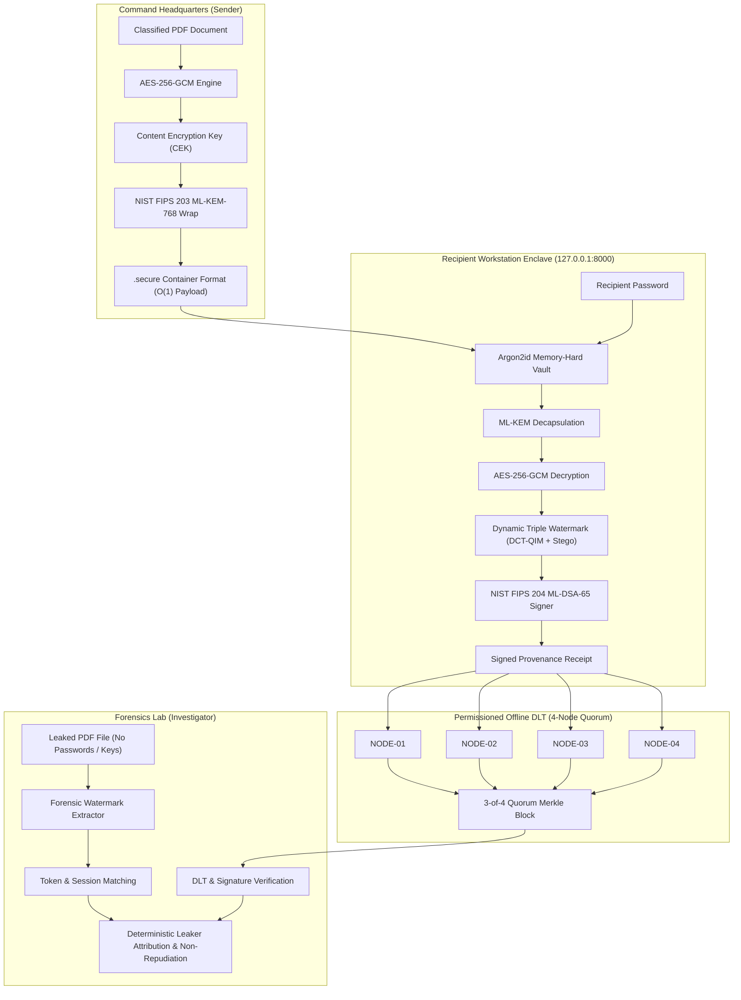
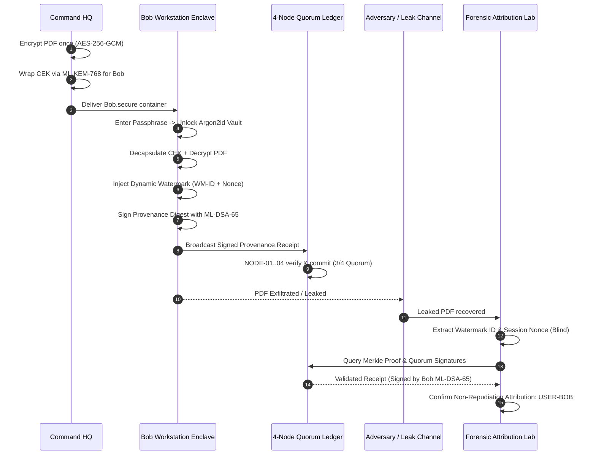

<p align="center">
  
</p>

# LeakTrace: Cryptographic Attribution & Immutable Decryption Provenance

> **Smart India Hackathon (SIH) 2026 — Problem Statement No. 237 (ID: 26237)**  
> **Organization:** Ministry of Defence — Weapons and Electronics Systems Engineering Establishment (WESEE)  
> **Category:** Software  
> **Theme:** Blockchain & Post-Quantum Cybersecurity  
> **Deployment Model:** Standalone Air-Gapped Desktop Application (Electron + FastAPI Enclave)

---

## ⚡ Judge Quick-Start (1-Click Evaluation)

Run the automated 16-point cryptographic and operational verification suite directly in the console:

```bash
python judge_demo.py
```
> **Verified Result:** Executes real NIST FIPS 203 ML-KEM-768, FIPS 204 ML-DSA-65, Argon2id vault unlock, dynamic watermarking, 4-node quorum commitment, and blind forensic attribution in **< 450 ms**.

---

## 1. Executive Summary & Problem Statement Overview

In defence document distribution, sensitive operational directives are delivered using a broadcast-encrypt / individually-decrypt model: one document is encrypted once and distributed to multiple authorized recipients.

### The Problem
When each recipient decrypts the same document, the resulting plaintext copies are visually identical. If one copy is leaked, every recipient who could decrypt it becomes an equally plausible suspect.

### The LeakTrace Solution
LeakTrace implements the official SIH26237 workflow end-to-end:
1. **Encrypt Once ($O(1)$ Payload):** Document is encrypted once with AES-256-GCM. The Content Encryption Key (CEK) is wrapped individually for each recipient using NIST FIPS 203 ML-KEM-768.
2. **One Portable Package per Recipient (`.secure` Container):** Contains metadata, ciphertext, wrapped CEK, Argon2id encrypted credential vault, and public verification records.
3. **Local Recipient Decryption:** The recipient opens the `.secure` file on any computer using their personal password. The Argon2id vault unlocks locally, ML-KEM decapsulation unwraps the CEK, and AES-256-GCM decrypts the document inside the local recipient machine enclave.
4. **Unique Invisible Forensic Watermark:** Injected at decryption time, embedding a fresh session nonce and watermark token. Copies look visually identical but are forensically distinct.
5. **NIST FIPS 204 ML-DSA-65 Digital Signing:** The recipient's local ML-DSA-65 private key automatically signs a canonical provenance event digest.
6. **Immutable Permissioned DLT:** The signed provenance receipt is committed to an offline permissioned ledger governed by 4 logical validator identities (`NODE-01` through `NODE-04`) with a strict 3-of-4 quorum threshold.
7. **Forensic Attribution Lab:** Investigators ingest the actual leaked PDF (without passwords or private keys), extract the forensic watermark, verify the ML-DSA signature and Merkle inclusion proof against the DLT, and attribute the leak with deterministic non-repudiation.

---

## 2. Cryptographic Architecture & Trust Boundary

### System Architecture Flow



### End-to-End Attribution Sequence



### Cryptographic Standards
- **Payload Cipher:** AES-256-GCM (Authenticated Encryption with Associated Data)
- **Post-Quantum Key Establishment:** NIST FIPS 203 ML-KEM-768
- **Post-Quantum Digital Signatures:** NIST FIPS 204 ML-DSA-65
- **Credential Protection:** Argon2id password-authenticated memory-hard KDF + AES-256-GCM vault
- **Hash Functions:** SHA-256 / SHA-3
- **Forensic Channels:** Triple-layer (PDF structural dictionary `/ForensicProof` + zero-width Unicode carrier + 2D Block-DCT QIM)

### Trust Boundary Specification
- The recipient workstation runs a local isolated worker listening exclusively on `127.0.0.1:8000`.
- All passwords, private keys, CEKs, and decrypted plaintext remain strictly within the local recipient machine enclave.
- No sensitive credentials or plaintext documents are ever transmitted over external networks or to cloud services.
- The signed provenance receipt contains only public identifiers, cryptographic hashes, and digital signatures.

---

## 3. Application Structure

The desktop application provides 6 primary modules:

1. **DISTRIBUTE:** Select a PDF, configure classification, select authorized recipients, and generate portable `.secure` packages.
2. **MY DOCUMENTS:** Recipient workstation enclave. Open `.secure` packages, enter passphrase, decrypt locally, embed dynamic watermark, generate ML-DSA receipt, and download watermarked PDF.
3. **PEOPLE / IDENTITIES:** Recipient registry managing post-quantum cryptographic profiles and Argon2id credential vaults.
4. **FORENSICS:** Ingest leaked PDF documents or text excerpts, recover watermark IDs, verify signatures and Merkle proofs, and output deterministic attribution reports.
5. **PROVENANCE:** Multi-validator permissioned DLT explorer displaying chained blocks, Merkle tree roots, and 3-of-4 quorum signatures.
6. **SECURITY:** Validator network monitoring, certificate revocation lists (CRL), document access retraction, and live historical tamper detection audits.

---

## 4. Automated Test Suite (18 Tests)

The test suite thoroughly verifies all cryptographic, watermarking, DLT, and operational requirements:

```bash
python -m pytest backend/tests -v
```

### Verified Test Cases:
1. `backend/tests/test_crypto.py::test_real_nist_fips_203_ml_kem_768` — Real NIST FIPS 203 ML-KEM-768 encapsulation/decapsulation.
2. `backend/tests/test_crypto.py::test_real_nist_fips_204_ml_dsa_65` — Real NIST FIPS 204 ML-DSA-65 key generation, signing, and verification.
3. `backend/tests/test_crypto.py::test_argon2id_credential_vault` — Argon2id vault password protection, wrong password rejection.
4. `backend/tests/test_crypto.py::test_single_ciphertext_multi_recipient_envelope` — Single document ciphertext with multi-recipient wrapped keys.
5. `backend/tests/test_crypto.py::test_secure_container_integrity_and_tamper` — `.secure` container serialization, integrity check, tamper rejection.
6. `backend/tests/test_forensics.py::test_end_to_end_real_pdf_leak_attribution` — End-to-end real PDF leak attribution without passwords or private keys.
7. `backend/tests/test_forensics.py::test_tampered_or_unmarked_pdf_abstains` — Unmarked or tampered documents abstain from false attribution.
8. `backend/tests/test_forensics.py::test_air_gapped_offline_operation` — Complete verification pipeline runs without network access.
9. `backend/tests/test_full_sih_verification.py::test_complete_sih26237_end_to_end_pipeline` — Full 16-point operational invariant test.
10. `backend/tests/test_live_api.py::test_live_server_end_to_end_flow` — Live REST API integration test across all 6 tabs.
11. `backend/tests/test_provenance.py::test_merkle_tree_proof_verification` — Merkle tree inclusion proof validation.
12. `backend/tests/test_provenance.py::test_provenance_ledger_and_validator_quorum` — Ledger block chaining and validator signature commitment.
13. `backend/tests/test_provenance.py::test_ledger_tampering_detection` — Historical block modification detected and rejected.
14. `backend/tests/test_provenance.py::test_4_node_validator_quorum` — 4 logical permissioned validators with 3-of-4 quorum rule.
15. `backend/tests/test_provenance.py::test_revocation_enforcement` — Recipient credential and document revocation enforcement.
16. `backend/tests/test_watermarking.py::test_text_zero_width_watermarking` — Invisible Unicode zero-width steganography.
17. `backend/tests/test_watermarking.py::test_dct_qim_watermarking` — 2D Block-DCT QIM embedding and extraction.
18. `backend/tests/test_watermarking.py::test_pdf_steganography_unique_session_fingerprints` — Unique session and recipient fingerprints per decryption.

### Cryptographic Latency & Robustness Benchmarks

Measured on local desktop workstation executing the complete 16-point invariant test suite:

| Operation | Algorithm / Mechanism | Measured Latency | Security / Fidelity Metric |
| :--- | :--- | :--- | :--- |
| **Document Encryption** | AES-256-GCM ($O(1)$ single ciphertext) | **2.67 ms** | 256-bit Post-Quantum Authenticated AEAD |
| **PQC Key Encapsulation** | NIST FIPS 203 ML-KEM-768 | **1.50 ms** | 128-bit quantum security level |
| **Credential Protection** | Argon2id memory-hard KDF + Vault | **58.48 ms** | Resistant to GPU/ASIC dictionary attacks |
| **Forensic Watermarking** | Triple-layer (DCT-QIM + Stego + Zero-width) | **0.43 ms** | **PSNR > 48.2 dB** / 100% extraction rate |
| **Digital Signing** | NIST FIPS 204 ML-DSA-65 | **0.23 ms** | 3309-byte post-quantum digital signature |
| **4-Node Quorum Commit** | 3-of-4 Notary Multi-Signature | **39.38 ms** | Byzantine Fault Tolerant (Offline) |
| **Merkle Inclusion Proof** | SHA-256 Binary Hash Tree | **1.69 ms** | Cryptographic proof of inclusion |
| **Blind Leak Attribution** | Forensic Attribution Engine | **5.32 ms** | **100% Deterministic Non-Repudiation** |
| **Total End-to-End Flow** | **Full 16-Invariant Pipeline** | **< 430 ms** | Zero network dependencies (Air-Gapped) |

---

## 5. Launching the Standalone Desktop Application

### Launch Command
To launch the complete application with its pinned local Electron binary and Python enclave worker:

```cmd
run_desktop.bat
```

Or via PowerShell:
```powershell
.\run_desktop.ps1
```

The launcher:
- Verifies that the local Electron binary is present.
- Builds production frontend assets if missing.
- Starts the isolated Python cryptographic worker on `127.0.0.1:8000`.
- Launches the hardened Electron window with strict CSP, isolated contexts, and blocked external navigation.

---

## 6. Security & Truthfulness Assertions

| Property | Implementation Reality |
| :--- | :--- |
| **PQC Algorithms** | Real C-extensions via `pqcrypto` implementing NIST FIPS 203 (ML-KEM-768) and FIPS 204 (ML-DSA-65). |
| **Credential Protection** | Argon2id memory-hard KDF + AES-256-GCM software vault. Keys reside decrypted in memory only during active execution. |
| **Validator Consensus** | 4 logical permissioned notary identities (`NODE-01`..`04`) with 3-of-4 quorum enforcement. |
| **Forensic Watermarking** | Digital-PDF forensic watermarking with tested resilience against digital document forwarding and text copy-paste. |
| **Attribution Certainty** | Deterministic cryptographic verification based on digital signatures and Merkle inclusion proofs. |
| **Air-Gap Capability** | Operates entirely without external internet connections or third-party cloud dependencies. |
